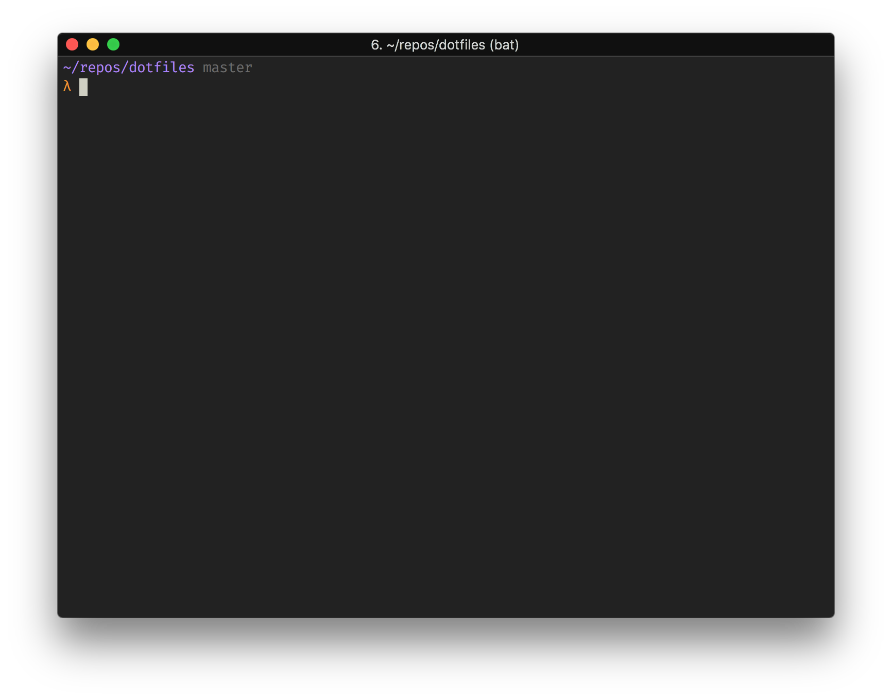

# My Dotfiles [](https://github.com/simeg/dotfiles/actions/workflows/ci.yml)

These are my dotfiles. There are many like them, but these ones are mine. My dotfiles are my best friends. They are my life. I must master them as I master my life. My dotfiles, without me, are useless. Without my dotfiles, I am useless.

<p align="center">
   
</p>


## 🚀 Quick Start

```bash
# Clone the repository
git clone https://github.com/simeg/dotfiles.git ~/.dotfiles
cd ~/.dotfiles

# Run the complete setup
make setup
# or
./setup.sh

# Verify everything is working
./validate.sh
```

## 📋 What's Included

- **Zsh Configuration** - Modern shell setup with znap plugin manager
- **Vim Setup** - Complete Vim configuration with plugins
- **Git Configuration** - Optimized Git settings and aliases
- **Starship Prompt** - Fast and customizable shell prompt
- **Custom Scripts** - Useful bin scripts for development workflow
- **Homebrew Integration** - Automated package management

## 🛠 Management Commands

### Setup & Installation
```bash
make setup           # Complete initial setup
./setup.sh           # Same as above with more options
./setup.sh --help    # See all setup options
```

### Updates & Maintenance  
```bash
./update.sh          # Update everything (git, packages, plugins)
./update.sh --help   # See all update options
./validate.sh        # Verify configuration is working
make lint            # Run shellcheck on all scripts
```

### Selective Operations
```bash
./setup.sh --symlink-only    # Only create symlinks
./update.sh --brew-only      # Only update Homebrew packages
./update.sh --vim-only       # Only update Vim plugins
./validate.sh --zsh          # Only validate Zsh config
```

## 📁 Directory Structure

```
├── zsh/                    # Zsh configuration files
│   ├── .zshrc             # Main Zsh configuration
│   └── .znap-plugins.zsh  # Plugin definitions
├── vim/                   # Vim configuration and plugins
├── git/                   # Git configuration files
├── starship/              # Starship prompt themes
│   └── themes/           # Available starship themes
├── bin/                   # Custom utility scripts
├── install/               # Installation scripts
│   ├── Brewfile          # Homebrew packages
│   ├── brew.sh           # Homebrew installer
│   ├── vim.sh            # Vim setup
│   └── zsh.sh            # Zsh setup
├── setup.sh              # Main setup script
├── update.sh             # Update script
├── validate.sh           # Configuration validator
└── symlink.sh            # Symlink creator
```

## 🔧 Custom Bin Scripts

Located in `bin/` directory, these scripts enhance your development workflow:

- **`backup`** - Backup utility
- **`cpwd`** - Copy current working directory to clipboard  
- **`fixup`** - Interactive Git fixup commits
- **`gforbm`** - Git fetch and rebase from main branch
- **`git-show`** - Enhanced git show with formatting
- **`live-status`** - Live system status monitoring
- **`rssh`** - Remote SSH utilities
- **`spuri`** - Python script for special URI handling
- **`squash`** - Interactive Git commit squashing
- **`super-amend`** - Enhanced Git amend workflow
- **`starship-theme`** - Easy starship theme switcher

## 🎨 Shell Features

### Zsh Plugins (via znap)
- **Syntax highlighting** - Real-time command syntax highlighting
- **Auto-suggestions** - Fish-like command suggestions from history
- **History search** - Multi-word history search
- **Git integration** - Git aliases and status integration
- **macOS utilities** - macOS-specific helper functions

### Prompt (Starship)
- Fast and lightweight prompt with multiple themes
- Git status integration and detailed information
- Directory context and navigation indicators
- Performance metrics and command duration
- Easy theme switching with `starship-theme` command

## 🎨 Starship Theme Management

This repository includes multiple starship themes and a convenient theme switcher:

### Available Themes

- **enhanced** - Full-featured theme with all modules (git metrics, language versions, etc.)
- **simple** - Balanced theme with essential info but not overwhelming
- **minimal** - Clean and fast prompt with only directory and git branch
- **neon** - Vibrant theme with bright colors and modern styling
- **rainbow** - Colorful theme with gradient effects and rich visual elements

### Theme Commands

```bash
starship-theme list              # List all available themes
starship-theme current           # Show current active theme
starship-theme set minimal       # Switch to minimal theme
starship-theme preview enhanced  # Preview theme configuration
starship-theme backup           # Backup current configuration
starship-theme restore          # Restore from backup
```

### Adding Your Own Themes

```bash
# Add a new theme from an existing .toml file
starship-theme add mytheme ~/path/to/my-starship.toml

# Or manually copy to themes directory
cp my-theme.toml starship/themes/
starship-theme set my-theme
```

### Theme Structure

Themes are stored in `starship/themes/` as `.toml` files. Each theme file should:
- Start with a descriptive comment (e.g., `# 🌟 Minimal Theme`)
- Be a valid starship configuration
- Include appropriate module settings

## 🔍 Validation & Troubleshooting

The `validate.sh` script checks:
- ✅ All symlinks are correctly created
- ✅ Required tools are installed
- ✅ Zsh plugins are loaded
- ✅ Git configuration is set
- ✅ Vim plugins are installed
- ✅ PATH includes custom bin directory

### Common Issues

**Symlinks not working?**
```bash
./symlink.sh  # Recreate symlinks
```

**Plugins not loading?**
```bash
./update.sh --zsh-only  # Update Zsh plugins
source ~/.zshrc         # Reload configuration
```

**Homebrew packages missing?**
```bash
./update.sh --brew-only  # Update packages
```

**Vim plugins not working?**
```bash
./update.sh --vim-only   # Update Vim plugins
```


## 📝 License

This project is licensed under the MIT License - see the LICENSE.md file for details.

## 🔐 Private Configuration

For sensitive environment variables (API keys, project IDs, etc.), use the private config file:

### Setup Private Config
```bash
# Create private config file (not tracked by git)
touch ~/.config/zsh/private.zsh
chmod 600 ~/.config/zsh/private.zsh

# Add sensitive variables
echo 'export ANTHROPIC_VERTEX_PROJECT_ID="your-project-id"' >> ~/.config/zsh/private.zsh
echo 'export API_KEY="your-api-key"' >> ~/.config/zsh/private.zsh
```

The `.zshrc` automatically sources `~/.config/zsh/private.zsh` if it exists. This file should:
- **Never be committed** to version control  
- Contain only sensitive environment variables
- Be created manually on each new machine during setup
- Be secured with proper file permissions: `chmod 600 ~/.config/zsh/private.zsh`

### Important Security Notes

⚠️ **CRITICAL**: The private configuration system is designed to keep sensitive data OUT of the repository:

1. **Private files are stored locally**: All sensitive configs live in `~/.config/zsh/` on your machine
2. **Automatic exclusion**: A `.gitignore` file in `~/.config/zsh/` prevents accidental commits
3. **Machine-specific setup**: You must create `private.zsh` on each new computer
4. **No cloud sync**: These files should NOT be synced to cloud storage or shared

### What Goes in Private Config

```bash
# ~/.config/zsh/private.zsh - Examples of what belongs here:
export ANTHROPIC_VERTEX_PROJECT_ID="your-project-id"
export OPENAI_API_KEY="your-api-key"
export AWS_ACCESS_KEY_ID="your-aws-key"
export GITHUB_TOKEN="your-github-token"
export DATABASE_URL="your-db-connection-string"

# Work-specific configurations
export WORK_EMAIL="your.work@company.com"
export COMPANY_VPN_CONFIG="/path/to/company/vpn"

# Personal API keys and tokens
export PERSONAL_GITHUB_TOKEN="your-personal-token"
export HOMEBREW_GITHUB_API_TOKEN="your-brew-token"
```

### Setting Up Private Config on New Machines

When you set up dotfiles on a new computer, remember to:

1. **Create the private config file**:
   ```bash
   touch ~/.config/zsh/private.zsh
   chmod 600 ~/.config/zsh/private.zsh
   ```

2. **Add your sensitive variables**:
   ```bash
   echo 'export YOUR_API_KEY="your-actual-key"' >> ~/.config/zsh/private.zsh
   ```

3. **Verify it's working**:
   ```bash
   source ~/.zshrc
   echo $YOUR_API_KEY  # Should show your key
   ```

4. **Confirm it's excluded from git**:
   ```bash
   git status  # private.zsh should NOT appear in untracked files
   ```

